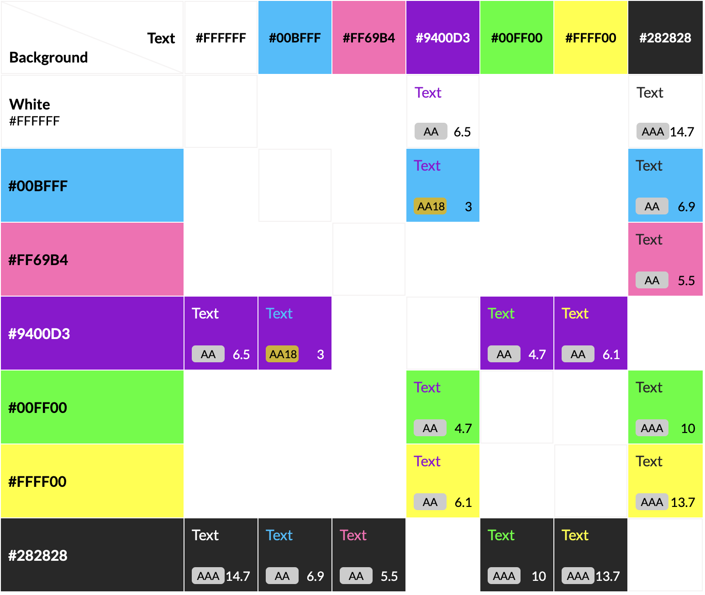
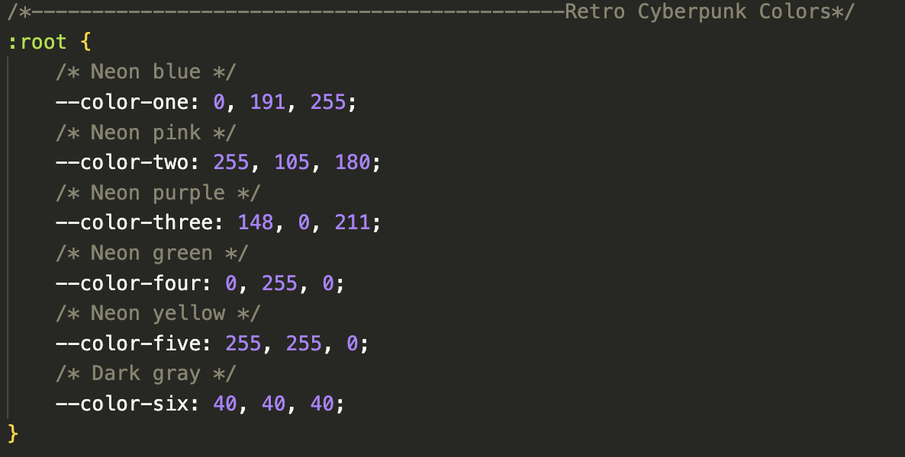

****Game-Space**
## **Site Overview**
(*disclaimer alot of the stuff is unfinished due to unforseen errors and on the actual project so please bear in mind alot the stuff is not complete)
## Contents-Page:
- [**Site Overview**](#site-overview)
- [Contents-Page:](#contents-page)
- [**Project Planning**](#project-planning)
  - [**Target Audiences:**](#target-audiences)
  - [**Site Objectives:**](#site-objectives)
  - [**User Stories:**](#user-stories)
  - [**How will this be achieved:**](#how-will-this-be-achieved)
  - [**WireFrames:**](#wireframes)
  - [**Color Scheme:**](#color-scheme)
- [**Current Features on all pages**](#current-features-on-all-pages)
  - [**Header**](#header)
  - [*Title:*](#title)
- [**Footer**](#footer)
- [**Typesetting**](#typesetting)
- [**Potential-Features**](#potential-features)
- [**Testing-Phase**](#testing-phase)
- [**Deployment**](#deployment)
- [**Credits**](#credits)
  - [**Honorable mentions**](#honorable-mentions)
  - [**General reference:**](#general-reference)
  - [**Content:**](#content)
  - [**Media:**](#media)

## **Project Planning**
### **Target Audiences:**
* For users who are interesting in a playing short games.
* For users who are learning about geography.

### **Site Objectives:**
* Allowing users to know of short fun facts about geography.
* Educating the user on using this as a fun way of educating themselves.

### **User Stories:**
Below is a list of things from different perspectives of different users

#### First Time User

> *"As a potential user, I would like to know what the site is about and what its used for"*
>
> *"As a non-registered user, I would like to experiment with the site"*
>
> *"As a non-registered user, I would like to be able to sign up"*
>

#### Returning User

##### Client

> *"As a returning user, I would like to be able to log in to my account and access any of the artciles at which i have wrote and posted"*
>
> *"As a returning user, I would like to be able to like any articles written by other users"*
>
> *"As a returning user, I would like to be able to edit some articles"*

#### Owner

> *"As the owener, I would like to be able to log in to my account"*
>
> *"As the owner, I would like to be able to add users"*
>
> *"As the owner, I would like to be able to add articles"*
>
> *"As the owner, I would like to be able to edit the articles"*
>
> *"As the owner, I would like to be able to delete users"*
>
> *"As the owner, I would like to be able to delete articles"*
>
> *"As the owner, I would like to be able to approve comments"*

***

### **How will this be achieved:**
* The project will have a projects tab at which it displays different tasks and potential features that be added on to the project at which i will include a link to [github-projects](https://github.com/users/leebri101/projects/3)

### **WireFrames:**
* In order to prevent any digression to project I have made a fewwire frames as a plan to refer back to from in case of any major changes.

[Wireframes](https://leebri101-game-space-bvmch14czu.us2.codeanyapp.com/files/download/?id=c68fd9f6-35ed-4c9c-ab85-cac98ce34c71) were all designed in Balsamiq desktop. a download link for preview is available to access.

### **Color Scheme:**
 * When creating the design of the quiz site I have went with this colour scheme to match the overall theme of the 80's vibe of retro colours with the colors of the neon colour elements.  

 

### **Reused Code:**
* Some code has been re-used in from the previous milestone projects due to the simplicity and effectiveness it has on the overall layout of the final design.

* i love to resuse this format of the code because it is simple and easy to reuse all the time with no issues with a simple and easy way to connect all colours into different numbers

<!--## **Current Features on all pages**
###  **Header**
* The header has been placed in the top center of the page to allow for a easy transition between desktop and mobile so it doesn't affect the page in huge way. 

 The header itself contains the following features:

### *Title:*
* The Title is there to show the name of the page.

-->
## **Footer**
* All icons that were used in the footer is sourced from font awesome.
* A personal copyright has been added in-case of plagerism.
* A personal link to my GitHub page which users can track my coding journey.

## **Typesetting**
 Throughout the fourth project milestone only this fonts that was used:
  * Orbitron - for the retro cyber punk look to match the theme of the colours.
  * VT323 - for teh retro video game look.
* Fonts that have used in the project have been sourced from Google Fonts (quoted in the credits).

## **Potential-Features**
* Due to the project deadline being in a very tight timeframe the project had to be scaled down to a more simpler version of the Blog site but these are the features that I would like to potentially add or implement in the near future:
    * An interactive version with sounds and unique animations.
* A different way of signing in the site e.g.
    * Through different social media apps like google, facebook, twitter (known as X now) or even git hub .
* A interactive gallery or collage of all of teh articles collated so its archived for people to read and react to.
* A way to link in to major services like the ganming industry to screenshot and post via xbox and sony.

***
## **Testing-Phase**
Full details of the testing phase can be found here: [TESTING.md](TESTING.md)
***
## **Deployment**
The project has been deployed with the following steps: -

1. Within the project's [repository](https://github.com/leebri101/Geographically-Challenged), you select the **Settings** tab.
2. Then select the **Pages** menu tab on the left side.
3. Under **Source** then, select the **Main** branch from the drop-down menu and click **Save**.
4. A message will then pop up that the project has been successfully deployed with a live link.

You can visit the live link via this URL - [Game-Space](https://leebri101.github.io/Game-Space/)
***

## **Credits**
### **Honorable mentions**
The fourth project was a very challenging concept of not from the usual concept of python but with more of the backend developments of the project, to understand how databases are integrated and coexist within the project. Not only does it just have the simple code of the basic front-end code it enhances it from the usual basic code , which is amazing but very finicky. In my honest oppinion it is a concept that i will need more exposure to in terms of fully understanding it a bit better and with the current timeline of me recently starting my new job within optics and juggling the coding was a challenge which led to burn out. But nonetheless it is a good way to showcase what I could do, but i must credit the following people:
 * [Can Sucullu](https://github.com/cansucullu) - My Code Institute mentor who is incredible at giving me ideas and suggestions on further improving my project, he is a huge help to continuously support me for any sort of technical issues within the project.
* The Slack community of Code Institute for helping me with Django modules as it is a very difficult concept to understand and with the time frame and the project deadline.
* Code Institute Tutors for assisting me with the technical aspects of the project i.e solving alot of the simple but hard to miss stuff such as the template tags and big issues in terms of adding in the allauth filling into the correct directory.
* Huge thanks to my girlfriend for the constant support and nagging me to stay focussed whenever i get distacted and also giving me useful advice and insight.

### **General reference:**
* The project theme was inspired by the Code Institute's coding project called I think therefore I blog. I have tried to change as much as possible but there may be some similarties within the codes. Due to the 
- I have used [Docs-Django](https://docs.djangoproject.com/en/dev/ref/models/fields/#django.db.models.ManyToManyField.through) for a better understanding of the Django code itself and for a general basic coding references and as general encyclopedia for any code related issues or ideas.

### **Content:**
* All icons that were used throughout the project are sourced from [Font-Awesome](https://fontawesome.com/)
* All fonts used have been imported from - [Google-Fonts](https://fonts.google.com/)
### **Media:**
* Background image on the home-page: [Retro-gaming-wallpaper](https://unsplash.com/photos/p0j-mE6mGo4)
* For custom favicon icon for tab of page on index.html: [Favicon-Generator](https://www.favicon.cc/)
* General RGB color Table used in style.css: [RGB-Table](https://www.rapidtables.com/web/color/RGB_Color.html)
* Image compressions: [TinyPNG](https://tinypng.com/)
* Colored grid scheme: [EightShapes](https://contrast-grid.eightshapes.com/)
* RapidTables for general encyclopedia for searching for colour themes: [RapidTables](https://www.rapidtables.com/web/color/RGB_Color.html)